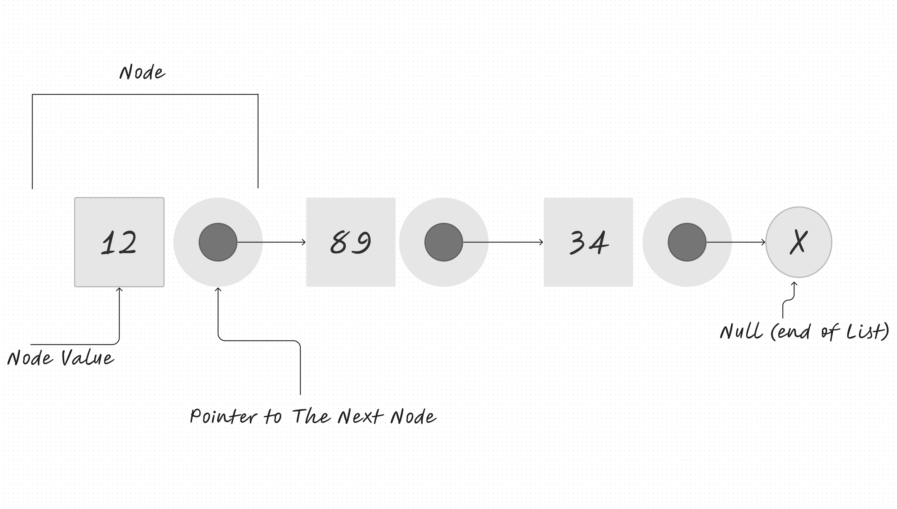

# Class 5 Reading Notes | Linked Lists

In computer science, a linked list is a linear collection of data elements, in which linear order is not given by their physical placement in memory. Instead, each element points to the next. It is a data structure consisting of a group of nodes that together represent a sequence. Under the simplest form, each node is composed of data and a reference (in other words, a link) to the next node in the sequence. This structure allows for the efficient insertion or removal of elements from any position in the sequence during iteration. More complex variants add additional links, allowing efficient insertion or removal from arbitrary element references. A drawback of linked lists is that access time is linear (and difficult to pipeline). Faster access, such as random access, is not feasible. Arrays have better cache locality as compared to linked lists.

## Linear Data Structures

Linked lists are linear data structures with a sequence and an order to how they are constructed and traversed.

Linear collection of data elements in which linear order is not given by their physical placement in memory. Instead, each element points to the next. It is a data structure consisting of a group of nodes that together represent a sequence.

## Linked Lists vs Arrays

The biggest difference between linked lists and arrays is the way they use memory.

### Array Creation (Static data structures)

When an array is created it requires a certain amount of memory, for example, if we created an array with 11 letters it would require 11 bytes in a contiguous block. In other words, we need 11 bytes, one byte next to the other, all together in one place.

If you were to add any elements to an array you will need to recreate it with more memory.

### Linked List Creation (Dynamic data structures)

When a linked list is created it doesn't need 11 bytes all next to each other. Linked lists don't need to take up a single block of memory but instead can be scattered throughout.

You can add or move elements within a linked list without any recreation.

## Parts of a Linked List

- Head: Starting Point
- Null: Ending Point
- Node: Consists of two parts
  - Data: Information stored
  - Next: Reference to the next node

A Single node only knows the data it contains and the reference (pointer) to the next node in the list.

## Singly-linked lists

This type of linked list goes in one direction and can be traversed from the head node which ends at the end (null value)

## Doubly linked list

This type of linked list goes in both directions and can be traversed from the head node to the end and the end to head node.

## Circular linked list

The circular linked list doesn't end with a node pointing to a null value. Instead, in a circular linked list, the first node and the last node are connected which forms a circle. There is no NULL at the end.

## Use Linked Lists when:

- You will access your data sequentially.

- You want to save memory and only allocate memory as you need it.

- You want constant time to remove/add from extremes of the list.

## Use Arrays when…

- You need to access data in random order fast (using an index).

- Your data is multi-dimensional (e.g., matrix, tensor).

|      Linked List         |         Array            |
| ------------------------ | ------------------------ |
| Inserting / Deleting Fast| Inserting / Deleting Slow|
| Serarching Slow          |      Searching Fast      |
| Grow and Shrink Easy     | Not easy to Grow / Shrink|
| Non-contiguous memory    |    Contiguous memory     |
| ------------------------ | ------------------------ |
| Useful if do know the    | Useful if dont know tge  |
| size of the list         | size of the list         |

## Sources

[What’s a Linked List, Anyway? [Part 1]](https://medium.com/basecs/whats-a-linked-list-anyway-part-2-131d96f71996)\
[What’s a Linked List, Anyway? [Part 2]](https://medium.com/basecs/whats-a-linked-list-anyway-part-1-d8b7e6508b9d)
